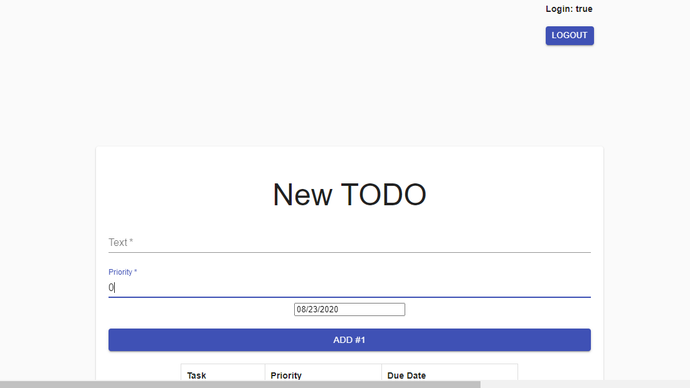

### Escuela Colombiana de Ingeniería
### Innovación y emprendimiento con TI

### Laboratorio 02 - React Material

### Codigo de honor:
Debes seguir el Código de honor del ingeniero de sistemas para defender el estándar de integridad académica de la ECI:

* Tus respuestas a tareas, cuestionarios y exámenes deben ser tu propio trabajo (excepto para las tareas que permiten explícitamente la colaboración).

* No puedes compartir tus soluciones de tareas, cuestionarios o exámenes con otra persona a menos que el instructor lo permita explícitamente. Esto incluye cualquier cosa escrita por ti, como también cualquier solución oficial proporcionada por el docente o el monitor del curso.

* No puedes participar en otras actividades que mejorarán de manera deshonesta tus resultados o que mejorarán de manera deshonesta o dañarán los resultados de otras personas.

**Como compilarlo**

`npm install`
`npm start`

## Part 1: Create a Login Component

Despues de clonar el repositorio, instalarle las dependencias necesarias y crear el codigo correspondiente a las clases login.js y login.css seremos capaces de visualizar.

## Part 2: Enable App Navigation 

Una vez creemos nuestra clase TodoApp.js con todas las funcionalidades correspondientes a Todo podremos cambiar el aspecto del formulario segun las herramientas que nos provee react, de igual manera podremos navegar alrededor de las paginas mediados por los links de las mismas

## Part 3: Local Storage

Por ultimo ya con un usuario y contraseña almacenados en la variable localStorage (user: Mateo , password: IETI1234) podemos configurar una navegación mucho mas personalizada por nuestras paginas donde solo estando logueados podremos acceder a las funcionalidades de TodoApp, asi mismo se configuro un boton de logout para volver a la pagina de login.

   
### Authors

* **Mateo González**  - [mateu20](https://github.com/mateu20)
